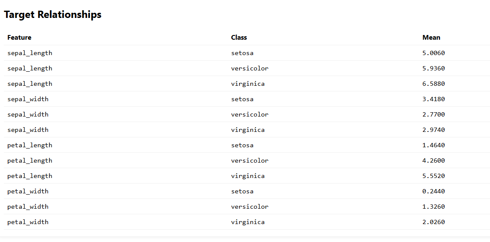

# auto-eda

**A lightweight, batteries-included Exploratory Data Analysis (EDA) tool.**  
Give it a dataset (CSV / TSV / Excel / Parquet / JSON) and it will generate a clean, interactive HTML report with:
- dataset overview & schema
- missingness summary
- numeric/categorical statistics
- correlations
- key visuals (histograms, box plots, top categories, pairwise scatter, and more)

> All plots are interactive (Plotly). Reports are fully self-contained and easy to share.

---

## Quickstart

```bash
# 1) Create & activate a virtualenv (recommended)
python -m venv .venv
source .venv/bin/activate  # on Windows: .venv\Scripts\activate

# 2) Install
pip install -r requirements.txt

# 3) Run on your data
python -m auto_eda.cli --input path/to/data.csv --output report --target ColumnName
# or, after installing as a package:
auto-eda --input path/to/data.parquet --output report
```

The CLI will create a folder `report/` with `index.html` you can open in any browser.

---

## CLI Options

```
--input        Path to the dataset. Supports: .csv, .tsv, .xlsx, .xls, .parquet, .json
--output       Output directory (default: report)
--target       Optional target column for correlation/feature insights
--sep          Optional delimiter override for CSV/TSV
--sheet        Optional Excel sheet name (or index)
--max-rows     Optional row cap to speed up heavy files (default: no cap)
--sample       Optional sample fraction (0-1) to downsample for quick looks (default: 1.0)
```

Examples:
```bash
auto-eda --input data.csv --output my_report
auto-eda --input data.xlsx --sheet "Sheet1"
auto-eda --input big.parquet --max-rows 250000 --sample 0.25
auto-eda --input logs.json
```

---

## What you get

- **index.html**: a self-contained interactive report
- **assets/**: static images when needed (e.g., PNGs for summaries)

The report includes:
- **Overview**: rows, columns, memory usage, inferred types
- **Missingness**: by column and overall
- **Statistics**: numeric (mean, std, quantiles), categorical (top values)
- **Correlations**: Pearson/Spearman for numeric columns; target correlation when provided
- **Visuals**: histograms, boxplots, bar charts (top categories), correlation heatmap, pairwise scatter

---

## Developer Notes

- Code is modular and readable under `src/auto_eda/`
- No heavy dependencies beyond ubiquitous data stack
- Works offline; all JS is embedded in the report

---

# My Project

Here is a screenshot:





## License
MIT